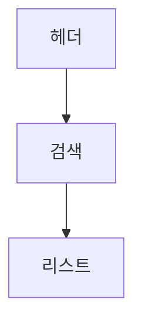

# 🚀 AI UI Agent Enterprise Workbench PRD v2.0

---

## 0. 제품 정의

AI Workbench는 코드 또는 시나리오를 입력받아
UI 구조(1-2-3 계층)를 자동 생성하고, 이를 기반으로 다음 4가지 결과를 제공하는 시스템이다.

* Preview (UI Mock)
* Business Flow
* System Diagram (Mermaid)
* Code Guide (Spec)

---

## 1. 핵심 개념

### 1.1 1-2-3 Hierarchy

| Depth   | 의미                             |
| ------- | ------------------------------ |
| 1-Depth | 프로젝트                           |
| 2-Depth | UI 그룹 (Header / Body / Footer) |
| 3-Depth | 실제 UI 생성 단위 (최소 렌더링 단위)        |

👉 모든 기능은 3-Depth 기준으로 동작

---

### 1.2 시스템 처리 흐름

```
Repo 분석 / 시나리오 입력
  ↓
scenario_v1 생성
  ↓
flow 생성
  ↓
diagram 생성
  ↓
code_guide 생성
```

---

## 2. 전체 UI 구조 (고정)

| 영역 | 비율  | 역할                              |
| -- | --- | ------------------------------- |
| 좌측 | 22% | Project Tree                    |
| 중앙 | 38% | Scenario Editor                 |
| 우측 | 40% | Preview / Flow / Diagram / Code |

👉 절대 변경 금지

---

## 3. 좌측: Project Tree

### 3.1 구조

```
Project
 ├── 1. Header
 │    ├── 1-1 헤더 네비게이션
 │    ├── 1-2 배너 영역
 ├── 2. Body
 │    ├── 2-1 검색 영역
 │    ├── 2-2 리스트 영역
 ├── 3. Footer
```

---

### 3.2 기능

* 노드 클릭 → 중앙 + 우측 동기화
* 상태 표시

  * 완료: 초록
  * 미완료: 회색
* 노드 수정 / 삭제 가능

---

## 4. 중앙: Scenario Editor

### 4.1 구성

* 변경 전 시나리오
* 변경 후 시나리오 (렌더링 기준)
* 자동 저장

---

### 4.2 버튼

| 버튼        | 기능             |
| --------- | -------------- |
| 트리 분석     | scenario_v1 생성 |
| 일괄 UI 렌더링 | 전체 UI 생성       |
| 현재 모듈 렌더링 | 선택 노드 렌더링      |

---

## 5. 우측 패널

---

### 5.1 PREVIEW

* 모바일 프레임 기반 UI
* 선택 노드 강조
* Gap-Zero 조립

  * margin: 0
  * padding: 0
  * line-height: 0

---

### 5.2 FLOW

#### 구조

```json
{
  "steps": [
    {
      "step": 1,
      "node_id": "1-1",
      "title": "헤더 네비게이션",
      "description": "...",
      "status": "default | selected | modified"
    }
  ]
}
```

#### 규칙

* 사용자 흐름 순서 유지
* selected → 보라색
* modified → 주황색

---

### 5.3 DIAGRAM

#### Mermaid 규칙

* flowchart TB
* 모든 노드 라벨은 "" 사용
* 세로 흐름 구조

#### 예시



#### 상태

* selected → 보라색
* modified → 주황색

---

### 5.4 CODE

#### 구조

```json
{
  "items": [
    {
      "file_name": "Header.tsx",
      "file_type": "REACT",
      "badge": "Update Required",
      "reason": "...",
      "guides": []
    }
  ]
}
```

---

#### 규칙

* 모든 항목 기본: Update Required
* 수정된 항목 → 주황 강조
* 파일 타입 자동 추론

---

## 6. 백엔드 구조

### 6.1 LangGraph Pipeline

```
repo_load
 → file_scan
 → scenario_v1
 → flow
 → diagram
 → code_guide
 → finalize_output
```

---

### 6.2 State 구조

```python
WorkbenchState = {
  repo_url,
  branch,
  local_repo_path,

  scenario_v1,
  flow,
  diagram,
  code_guide,

  selected_node_id,
  modified_node_ids,

  result
}
```

---

### 6.3 API

#### POST /analyze-repo

```json
{
  "repo_url": "...",
  "branch": "main"
}
```

---

#### Response

```json
{
  "result": {
    "scenario_v1": {},
    "flow": {},
    "diagram": {},
    "code_guide": {}
  }
}
```

---

## 7. 핵심 규칙

### 7.1 금지 사항

* UI 레이아웃 변경
* Depth 구조 변경
* Preview padding/margin 사용

---

### 7.2 필수 유지

* 3단 레이아웃
* 1-2-3 계층 구조
* Flow / Diagram / Code 연동

---

## 8. 상태 정의

| 상태                | 의미      |
| ----------------- | ------- |
| default           | 기본      |
| selected          | 선택됨     |
| modified          | 수정됨     |
| selected_modified | 선택 + 수정 |

---

## 9. 향후 확장

* Preview 자동 생성 (LLM 기반)
* AI 시나리오 생성
* Git 자동 반영
* HITL (Human-in-the-loop)

---

## 10. 현재 구현 상태

| 기능          | 상태  |
| ----------- | --- |
| scenario_v1 | 완료  |
| flow        | 완료  |
| diagram     | 완료  |
| code_guide  | 완료  |
| preview     | 미완성 |
| 프론트 연동      | 진행중 |

---

## 🔥 한 줄 정의

👉 코드를 읽고 기획서를 생성하고 개발까지 연결하는 AI 워크벤치
